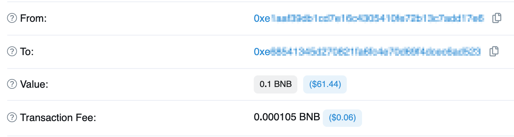

## `0x01` Ether & Gwei & Wei
---
> `Ether`, `Gwei`, `Wei` 모두 Ethereum이란 블록체인에서 일어나는 모든 인터렉션에서 사용하는 가치를 나타내는 용어라고 생각하면 됩니다.

```
1 Ether == 10^9 Gwei == 10^18 == Wei
```

`Wei`는 Ethereum에서 가장 작은 단위이고, `Gwei`는 `Gas fee`의 가장 작은 단위입니다.

하지만 작은 단위임에도 숫자 단위가 크다고 느낄 수 있습니다.

이렇게 단위가 큰 이유는 Solidity에서는 부동소수점 타입(float)를 지원하지 않기 때문입니다.
- `1Ether`의 크기가 큰 이유는 Solidity에서 숫자는 기본적으로 int형을 사용하며, 부동소수점 타입(float)을 사용하지 않기 때문입니다.
- 부동소수점 타입으로는 수를 정확하게 표현하지 못하기 때문에 사용하지 않습니다.

> 이처럼 소수점 타입을 제대로 지원하지 않기 때문에 소수점이 발생하지 못할 큰 단위의 수를 사용하는 것입니다.

## `0x02` Gas
---
> 이더리움 환경에서는 블록체인과 어떠한 인터렉션을 할 때 마다 **Gas**가 소모됩니다.

Gas를 쉽게 보면 **수수료** 라고 볼 수 있습니다.
- 나의 인터렉션(SmartContract)이 블록체인과 연결되어 어떠한 경우로든 간에 영향을 끼칠 때, 모든 활동은 블록에 기록되게 됩니다.
- 이때, 나의 어떠한 활동을 블록체인에 기록을 하는 주체가 내가 아닌 **채굴자**라는 사람들이 대신 기록을 해줍니다.
    - Gas는 대신 기록해주는 것에 대한 수수료라고 볼 수 있습니다.

**Gas**의 최소 단위를 `Gwei`라고 하고, 가스비는 네트워크 사용량에 따라 유동적으로 변합니다.
- 우리가 주유를 할 때 1리터만 넣는 경우는 별로 없듯이, `주유하는 양(블록체인과 인터렉션에 필요한 데이터 or 연산 양) * Gwei`를 통해 Transaction fee(거래 수수료)가 결정되게 됩니다.



> 위 그림은 Transaction Details의 일부입니다.

- **A(From)**가 **B(To)**에게 `0.1BNB`를 보낸 거래 명세서로 보면 됩니다.
- 이때 `value`를 확인하면 이체되는 금액이 `0.1BNB`인 것을 볼 수 있고, Transaction Fee를 보면 거래 수수료 `0.000105BNB`가 빠져나간 것을 확인할 수 있습니다.

### Gas의 장점
---
> Gas 비의 존재 때문에 DDoS 공격등에 대해 안전해진다.

- 만약 해커가 의미없는 트래픽으로 블록체인을 과부화시키는 스마트 컨트랙트를 개발한다 했을 때 해커는 비용적인 측면을 무시할 수 없기 때문입니다.

### Gas의 단점
---
> 블록체인의 사용자가 늘어나면 가스비가 비싸진다.

- Smart Contract를 개발하는 개발자는 어떤 Contract든 복잡도를 낮춰야 하고, 블록에 추가되는 data의 사이즈도 최대한 고려하면서 Contract를 설계해야한다.
